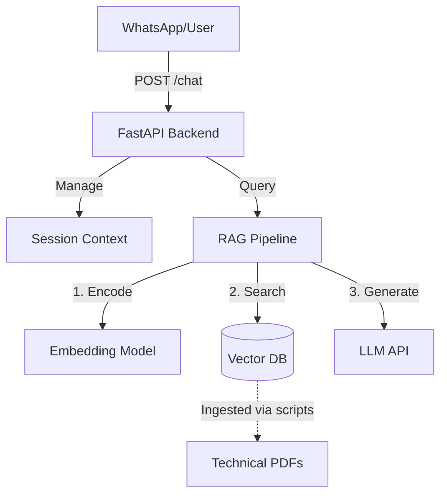

# Project Overview
Arte Chatbot es un sistema de respuesta automática (RAG) diseñado para automatizar la atención al cliente de primer nivel en Arte Soluciones Energéticas, una empresa B2B de energía solar. El proyecto se desarrolla siguiendo la metodología Walking Skeleton y está diseñado para ingerir fichas técnicas de productos (paneles, inversores, etc.) para responder consultas especializadas, detectar intenciones y escalar conversaciones complejas a agentes humanos, liberando al equipo de ventas de tareas repetitivas.

## Repository Structure
- `backend/` – API REST desarrollada con FastAPI que expone el endpoint principal del chatbot y gestiona las sesiones.
- `rag/` – Módulo central que encapsula la lógica de Retrieval-Augmented Generation (embeddings, vector store, prompts y llamadas al LLM).
- `evaluation/` – Scripts y harnesses automatizados para medir latencia, precisión técnica y tasas de alucinación/escalamiento.
- `docs/` – Documentación técnica en Markdown, incluyendo Architecture Decision Records (ADR).
- `docker-compose.yml` – Orquestador principal que levanta los servicios requeridos (API, Vector DB, etc.) en entornos locales.

## Build & Development Commands

```bash
# Levantar el entorno de desarrollo completo (Backend + DBs)
docker compose up -d

# Reconstruir imágenes tras cambios en dependencias
docker compose up -d --build

# Ver logs del backend en tiempo real
docker compose logs -f backend

# Ejecutar tests de salud
curl http://localhost:8000/health

# Entrar al contenedor del backend (para debug o correr scripts manualmente)
docker compose exec -it backend bash
```

## Code Style & Conventions
- **Arquitectura de Software**: Se deben aplicar los principios **SOLID** en todo momento. Cada módulo (`rag/`, `backend/`) debe tener responsabilidades únicas, depender de abstracciones mediante interfaces/protocolos de Python, y estar cerrado a modificación pero abierto a extensión (especialmente útil para cambiar proveedores de LLM o VectorDBs).
- **Gestor de Dependencias**: Se utiliza **`uv`** (no pip, poetry o conda) para una gestión rápida y predecible de dependencias.
- **Tipado**: Python con Type Hints obligatorios (`typing`) en todas las funciones y métodos.
- **Commits**: Seguir convenciones semánticas (`feat:`, `fix:`, `chore:`, `docs:`), idealmente referenciando el número de issue o tarea técnica (e.g., `feat: [US-01] agregar endpoint /chat`).

## Architecture Notes
El sistema sigue una arquitectura de microservicios contenerizada e iterativa:


**Data Flow**: Las consultas entran al backend (FastAPI), que preserva el contexto de sesión. La consulta se pasa al módulo RAG, que busca documentos similares en la base de datos vectorial (ChromaDB/Qdrant), ensambla un prompt con el contexto recuperado y lo envía al LLM (OpenAI/Anthropic) para generar una respuesta o activar el flag de escalamiento.

## Testing Strategy
- **Framework de Testing**: Se utiliza **pytest** como framework principal para tests unitarios y de integración. Los tests se organizan en carpetas `tests/` dentro de cada módulo (`backend/tests/`, `rag/tests/`).
- **Desarrollo guiado por tests**: Toda nueva feature debe incluir sus correspondientes tests. Se espera que:
  - Cada feature nueva tenga tests unitarios que cubran la lógica de negocio.
  - Cuando la feature interactúe con componentes externos (APIs, bases de datos), se incluyan tests de integración.
  - Los tests deben ejecutarse exitosamente antes de crear un Pull Request.
- **Pruebas de Evaluación (Harness)**: El módulo `/evaluation` contiene scripts que envían queries de prueba al endpoint `/chat` para medir `latency_ms`, `session_id`, exactitud de la respuesta, tasa de escalamiento y fuentes citadas (`source_documents`).
- **CI/CD**: GitHub Actions ejecuta linting, tests con pytest y pruebas básicas de salud (endpoint `/health`) en cada Pull Request.
- **Ejecución Local**: Para evaluar cambios en el RAG, se deben correr localmente los scripts de evaluación antes de hacer push.

### Comandos de Testing

```bash
# Ejecutar todos los tests
pytest

# Ejecutar tests con coverage
pytest --cov=backend --cov=rag

# Ejecutar tests dentro del contenedor
docker compose exec backend pytest
```

## Security & Compliance
- **Manejo de Secretos**: Ninguna llave de API (OpenAI, Anthropic, etc.) debe ser subida al repositorio. Utilizar un archivo `.env` local (ya en `.gitignore`).
- **Guardrails del Agente**:
  - **Uso de MCP (Model Context Protocol)**: El agente DEBE usar el **GitHub MCP** para consultar el contenido y los criterios de aceptación de los issues y PRs asignados antes de generar código. El link al repositorio es https://github.com/creep1ng/arte-chatbot/ y el link al proyecto es https://github.com/users/creep1ng/projects/6.
  - **Ingesta de documentación de librerías**: El agente debe asumir que la documentación de librerías se puede consultar vía Context7 MCP, si está configurado.
  - Nunca crear dependencias circulares entre `/backend` y `/rag`.
  - Las decisiones arquitectónicas de peso deben documentarse primero en `/docs/adr/`.

## Extensibility Hooks
- **Interfaces RAG**: El código en `rag/` debe definir clases abstractas (ej. `BaseRetriever`, `BaseGenerator`) para facilitar el intercambio del motor de base de datos o el modelo fundacional sin alterar el backend.
- **Variables de Entorno**: `LLM_PROVIDER`, `VECTOR_DB_HOST`, `LOG_LEVEL`.
- **Manejo de Contexto**: El sistema de sesiones está diseñado para escalar desde persistencia en memoria (Sprint 1) a bases de datos en disco (ej. PostgreSQL) en sprints posteriores.

## Further Reading
- [ADR-001: Arquitectura inicial y orquestación de servicios](docs/adr/001.md)
- [Plantilla de ADR](docs/adr/template.md)
