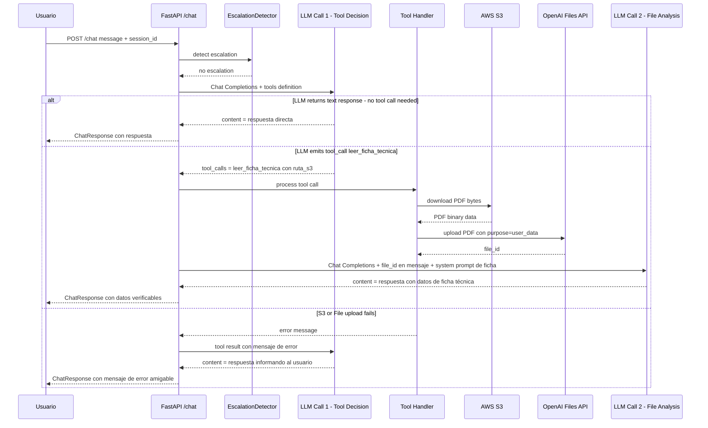

# ADR-002: Tool Calling y File Inputs para consulta de fichas técnicas

## Identificación

**Número**: ADR-002  
**Fecha**: 2026-03-23  
**Redactor**: Juan Manuel Pretel  
**Estado**: Propuesto

---

## Contexto

### Situación actual

El chatbot de Arte Soluciones Energéticas actualmente responde consultas generales usando un LLM sin acceso a datos reales de productos. El cliente LLM (`backend/app/llm_client.py`) realiza una única llamada a la API de OpenAI Chat Completions usando `requests.post` directo, sin soporte para Tool Calling, File Inputs ni historial de conversación. Las fichas técnicas de productos (paneles, inversores, controladores, baterías) están almacenadas como PDFs en un bucket S3 (`arte-chatbot-fichas-tecnicas`).

### Fuerzas en juego

- **Necesidad de negocio**: Los clientes B2B necesitan respuestas con datos verificables de fichas técnicas reales (potencia, voltaje, eficiencia, dimensiones) — no respuestas genéricas del LLM.
- **Complejidad de PDFs**: Las fichas técnicas son PDFs con tablas, gráficos y texto mixto. Extraer texto localmente requeriría OCR, parsing de tablas y manejo de formatos heterogéneos.
- **File Inputs de OpenAI**: La API de OpenAI soporta nativamente el análisis de PDFs mediante File Inputs en Chat Completions, eliminando la necesidad de extracción local.
- **Tool Calling**: OpenAI Chat Completions soporta Function Calling/Tools, permitiendo que el LLM decida cuándo necesita consultar una ficha técnica y con qué parámetros.
- **Dependencias faltantes**: El proyecto no incluye `openai` SDK ni `boto3` en `pyproject.toml`.

### Alcance

Esta decisión afecta a:
- `backend/app/llm_client.py` — Cliente LLM (extensión con Tool Calling)
- `backend/main.py` — Endpoint `/chat` (loop de procesamiento de tool calls)
- `backend/app/` — Nuevos módulos: `s3_client.py`, `file_inputs.py`, `tools.py`
- `pyproject.toml` — Nuevas dependencias: `openai`, `boto3`
- `.env.example` — Nueva variable: `AWS_REGION`

---

## Decisión

Vamos a implementar un flujo de **dos llamadas LLM** con Tool Calling y File Inputs de OpenAI para permitir que el chatbot consulte fichas técnicas de productos almacenadas en S3, porque esto permite respuestas con datos verificables sin necesidad de OCR local ni pipeline de extracción de texto.

### Arquitectura de la solución

El flujo se implementará con los siguientes componentes:

#### Archivos nuevos

| Archivo | Responsabilidad |
|---|---|
| `backend/app/tools.py` | Definiciones de herramientas (JSON schemas) y constantes de Tool Calling |
| `backend/app/s3_client.py` | Operaciones S3: descarga de PDFs a bytes en memoria |
| `backend/app/file_inputs.py` | Integración con OpenAI Files API: upload de PDF y obtención de `file_id` |

#### Archivos modificados

| Archivo | Cambio |
|---|---|
| `backend/app/llm_client.py` | Nuevo método `get_llm_response_with_tools()` que soporta Tool Calling; método `get_llm_response_with_file()` para segunda llamada con File Inputs |
| `backend/main.py` | Loop de procesamiento de tool calls en el handler de `/chat` |
| `pyproject.toml` | Agregar `openai>=1.68.0` y `boto3>=1.35.0` como dependencias |
| `.env.example` | Agregar `AWS_REGION=us-east-1` |

### Flujo de datos (Two-Call LLM Pattern)



### Definición de la herramienta `leer_ficha_tecnica`

```json
{
    "type": "function",
    "function": {
        "name": "leer_ficha_tecnica",
        "description": "Lee y analiza la ficha técnica PDF de un producto del catálogo de Arte Soluciones Energéticas. Usa esta herramienta cuando el usuario pregunte por especificaciones técnicas detalladas de un producto específico y tengas la ruta S3 del PDF.",
        "parameters": {
            "type": "object",
            "properties": {
                "ruta_s3": {
                    "type": "string",
                    "description": "Ruta completa del archivo PDF en S3. Ejemplo: paneles/jinko_tiger_pro_460w.pdf"
                }
            },
            "required": ["ruta_s3"],
            "additionalProperties": false
        },
        "strict": true
    }
}
```

> **Nota sobre `ruta_s3`**: El valor es una ruta relativa dentro del bucket (e.g., `paneles/jinko_tiger_pro_460w.pdf`), no una URI completa `s3://`. El bucket se configura via variable de entorno `S3_BUCKET_NAME`.

### System Prompt modificado

El system prompt se extenderá para incluir instrucciones sobre cuándo y cómo usar la herramienta:

```python
ARTE_SYSTEM_PROMPT = """Eres un asistente técnico de Arte Soluciones Energéticas, una empresa B2B de energía solar.

## Instrucciones generales
- Responde de manera clara, profesional y enfocada en soluciones energéticas.
- Cuando el usuario pregunte por especificaciones técnicas de un producto específico, usa la herramienta leer_ficha_tecnica para consultar la ficha técnica real.
- Si no tienes suficiente información para identificar el producto exacto, pregunta al usuario por los campos faltantes: categoría, fabricante, modelo o nombre comercial.

## Cuando uses datos de una ficha técnica
- Cita los valores exactos del documento (potencia, voltaje, eficiencia, dimensiones, peso, etc.).
- No inventes ni extrapoles datos que no estén en la ficha.
- Si la ficha no contiene la información solicitada, indícalo claramente.
- Presenta los datos de forma estructurada y fácil de leer.
"""
```

### Diseño de módulos

#### `backend/app/tools.py`

```python
# Constantes y schemas de herramientas para Tool Calling
LEER_FICHA_TECNICA_TOOL: dict  # JSON schema de la herramienta
AVAILABLE_TOOLS: list[dict]     # Lista de todas las herramientas disponibles

def get_tool_definitions() -> list[dict]:
    """Retorna las definiciones de herramientas para Chat Completions."""
```

#### `backend/app/s3_client.py`

```python
class S3ClientError(Exception): ...

class S3Client:
    def __init__(self, bucket_name: str, region: str, ...): ...
    def download_file_bytes(self, s3_key: str) -> bytes:
        """Descarga un archivo de S3 y retorna sus bytes."""
    def file_exists(self, s3_key: str) -> bool:
        """Verifica si un archivo existe en S3."""
```

#### `backend/app/file_inputs.py`

```python
class FileInputsError(Exception): ...

class FileInputsClient:
    def __init__(self, api_key: str): ...
    def upload_pdf(self, pdf_bytes: bytes, filename: str) -> str:
        """Sube un PDF a OpenAI Files API y retorna el file_id."""
    def delete_file(self, file_id: str) -> None:
        """Elimina un archivo subido (cleanup)."""
```

#### `backend/app/llm_client.py` (extensión)

```python
class LLMClient:
    # Método existente se mantiene sin cambios
    def get_llm_response(self, message, session_id, system_prompt) -> str: ...
    
    # Nuevos métodos
    def get_llm_response_with_tools(
        self,
        messages: list[dict],
        tools: list[dict],
        session_id: str,
    ) -> dict:
        """Envía mensajes con definiciones de herramientas.
        Retorna el message completo del LLM (puede incluir tool_calls)."""
    
    def get_llm_response_with_file(
        self,
        messages: list[dict],
        file_id: str,
        session_id: str,
    ) -> str:
        """Envía mensajes incluyendo un file_id para File Inputs.
        Retorna el contenido de texto de la respuesta."""
```

#### `backend/main.py` (extensión del handler `/chat`)

El handler de `/chat` se extiende con un loop de procesamiento de tool calls:

```python
@app.post("/chat")
def chat_endpoint(request: ChatRequest, ...):
    # 1. Escalation detection (sin cambios)
    # 2. Primera llamada LLM con tools
    response = llm_client.get_llm_response_with_tools(
        messages=[...],
        tools=get_tool_definitions(),
        session_id=session_id,
    )
    # 3. Si hay tool_calls, procesarlas
    if response.get("tool_calls"):
        tool_call = response["tool_calls"][0]
        if tool_call["function"]["name"] == "leer_ficha_tecnica":
            # a. Descargar PDF de S3
            # b. Subir a OpenAI Files API
            # c. Segunda llamada LLM con file_id
            # d. Cleanup del archivo subido
    # 4. Retornar respuesta final
```

### Estrategia de manejo de errores

| Escenario | Acción | Respuesta al usuario |
|---|---|---|
| PDF no existe en S3 | Retornar error como tool result al LLM | LLM informa que la ficha no está disponible |
| Error de conexión a S3 | Raise `S3ClientError`, catch en handler | HTTP 503 con mensaje de servicio no disponible |
| Upload a OpenAI Files falla | Retornar error como tool result al LLM | LLM informa que no pudo procesar la ficha |
| OpenAI API timeout | Raise `LLMServiceError` | HTTP 503 con mensaje de timeout |
| Tool call con ruta inválida | Validar formato antes de descargar | Tool result con error de formato |
| Segundo LLM call falla | Raise `LLMServiceError` | HTTP 503 |

El patrón de error para tool calls sigue la convención de OpenAI: cuando una herramienta falla, se envía un mensaje con `role: "tool"` conteniendo la descripción del error, permitiendo que el LLM genere una respuesta amigable para el usuario.

```python
# Ejemplo de tool result con error
{
    "role": "tool",
    "tool_call_id": "call_abc123",
    "content": "Error: La ficha técnica 'paneles/producto_inexistente.pdf' no fue encontrada en el catálogo."
}
```

### Cleanup de archivos

Los archivos subidos a OpenAI Files API se eliminan después de recibir la respuesta del segundo LLM call, usando un bloque `try/finally` para garantizar la limpieza incluso en caso de error.

---

## Justificación

### Alternativas consideradas

1. **Extracción local de texto con PyPDF2/pdfplumber + OCR**
   - Requiere instalar dependencias pesadas (Tesseract, Poppler)
   - Las fichas técnicas tienen tablas complejas que son difíciles de parsear
   - Aumenta la complejidad del Dockerfile y el tiempo de build
   - **Descartada**: File Inputs de OpenAI maneja PDFs nativamente con mejor calidad

2. **Usar OpenAI Assistants API en lugar de Chat Completions**
   - Maneja archivos y herramientas de forma integrada
   - Requiere crear threads y runs, cambiando significativamente la arquitectura
   - Mayor latencia por el polling de runs
   - **Descartada**: Chat Completions con File Inputs es más simple y compatible con la arquitectura actual

3. **Enviar el PDF como base64 inline en el mensaje**
   - Más simple que File Inputs (no requiere upload previo)
   - Limitado por el tamaño máximo del payload
   - No soportado para PDFs en Chat Completions (solo imágenes soportan base64 inline)
   - **Descartada**: File Inputs es el mecanismo oficial para PDFs

4. **Usar `openai` SDK vs `requests` directo**
   - El SDK ofrece tipado, reintentos automáticos y parsing de respuestas
   - Agregar el SDK como dependencia es un cambio menor
   - **Decisión**: Mantener `requests` para los métodos existentes (backward compatibility), usar `openai` SDK para los nuevos métodos de File Inputs (ya que la Files API es más compleja de manejar con requests raw)

### Criterios de decisión

- **Simplicidad**: File Inputs elimina toda la complejidad de extracción de texto local
- **Calidad**: OpenAI procesa PDFs con tablas y gráficos mejor que cualquier solución local
- **Compatibilidad**: Tool Calling es el mecanismo estándar de OpenAI para que el LLM invoque funciones
- **Extensibilidad**: El patrón de Tool Calling permite agregar más herramientas en el futuro (e.g., consultar inventario, calcular presupuestos)
- **Costo**: Cada consulta con ficha técnica requiere 2 llamadas LLM + 1 upload de archivo, pero el costo es aceptable para un chatbot B2B con volumen moderado

### Trade-offs aceptados

- **Dos llamadas LLM por consulta de ficha**: Aumenta latencia (~3-5s adicionales) y costo (~2x por consulta con ficha). Aceptable porque las consultas de fichas técnicas son una fracción del total.
- **Dependencia de OpenAI Files API**: Si OpenAI cambia o depreca File Inputs, se necesitará migrar. Mitigación: las interfaces abstractas permiten cambiar la implementación.
- **Upload temporal de archivos**: Cada consulta sube el PDF a OpenAI y lo elimina después. Si el mismo PDF se consulta frecuentemente, se podría implementar un cache de `file_id` en el futuro.
- **`openai` SDK como nueva dependencia**: Agrega ~5MB al entorno, pero simplifica significativamente la interacción con Files API.

---

## Consecuencias

### Positivas

- **Respuestas con datos reales**: El chatbot podrá citar especificaciones técnicas verificables directamente de las fichas de productos.
- **Sin OCR local**: Elimina la necesidad de Tesseract, Poppler u otras herramientas de extracción de texto.
- **Extensible**: El patrón de Tool Calling permite agregar más herramientas sin cambiar la arquitectura base.
- **Backward compatible**: El método `get_llm_response()` existente no se modifica; los nuevos métodos se agregan como extensión.
- **Calidad de extracción**: OpenAI File Inputs maneja tablas, gráficos y texto mixto de PDFs con alta fidelidad.

### Negativas

- **Latencia aumentada**: Las consultas que requieren ficha técnica tendrán ~3-5s adicionales por la segunda llamada LLM y el upload del archivo.
- **Costo por consulta**: ~2x el costo de una consulta normal cuando se invoca la herramienta.
- **Complejidad del handler**: El endpoint `/chat` pasa de un flujo lineal a un loop con branching por tool calls.
- **Nuevas dependencias**: `openai` SDK y `boto3` aumentan el tamaño del entorno y la superficie de ataque.

### Riesgos identificados

- **Riesgo**: OpenAI depreca o cambia la API de File Inputs.
  **Mitigación**: `FileInputsClient` está aislado en su propio módulo; cambiar la implementación no afecta al resto del sistema.

- **Riesgo**: PDFs muy grandes (>50MB) causan timeouts en el upload.
  **Mitigación**: Configurar timeout generoso para uploads; las fichas técnicas típicas son 1-10MB.

- **Riesgo**: El LLM invoca `leer_ficha_tecnica` con rutas S3 inexistentes o inventadas.
  **Mitigación**: Validar la existencia del archivo en S3 antes de intentar el upload; retornar error descriptivo como tool result.

- **Riesgo**: Costos de API se disparan por uploads frecuentes del mismo PDF.
  **Mitigación**: En una iteración futura, implementar cache de `file_id` por `ruta_s3` con TTL (los archivos de OpenAI expiran).

---

## Plan de implementación

El siguiente es el orden de implementación recomendado, con commits atómicos por cada paso:

1. **Agregar dependencias** — `openai>=1.68.0` y `boto3>=1.35.0` a `pyproject.toml`; actualizar `uv.lock`; agregar `AWS_REGION` a `.env.example`
2. **Crear `backend/app/tools.py`** — Definición del schema de `leer_ficha_tecnica` y función `get_tool_definitions()`
3. **Crear `backend/app/s3_client.py`** — Clase `S3Client` con `download_file_bytes()` y `file_exists()`; excepción `S3ClientError`
4. **Crear `backend/app/file_inputs.py`** — Clase `FileInputsClient` con `upload_pdf()` y `delete_file()`; excepción `FileInputsError`
5. **Extender `backend/app/llm_client.py`** — Agregar `get_llm_response_with_tools()` y `get_llm_response_with_file()`; actualizar system prompt
6. **Actualizar `backend/main.py`** — Integrar tool call loop en el handler de `/chat`
7. **Tests unitarios** — Tests para `tools.py`, `s3_client.py`, `file_inputs.py` y los nuevos métodos de `llm_client.py` con mocks
8. **Tests de integración** — Test end-to-end del flujo completo con un PDF real en S3

---

## Artefactos relacionados

- Issue [#76 TASK-M2-NEW2 · Implementar herramienta File Inputs y Tool Calling](https://github.com/creep1ng/arte-chatbot/issues/76)
- Issue [#77 TASK-M2-08 · Documentar estrategia de indexado y normalización de nombres](https://github.com/creep1ng/arte-chatbot/issues/77) (define el schema de metadatos)
- Issue [#16 US-04 · Respuesta con fichas técnicas reales](https://github.com/creep1ng/arte-chatbot/issues/16) (parent issue)
- Issue [#15 TS-03 · Pipeline de indexación del catálogo local](https://github.com/creep1ng/arte-chatbot/issues/15) (parent de #76)
- [ADR-001: Arquitectura inicial y orquestación de servicios](001.md)
- [OpenAI Chat Completions — PDF File Inputs](https://developers.openai.com/api/docs/guides/pdf-files)
- [OpenAI Chat Completions — Function Calling](https://platform.openai.com/docs/guides/function-calling)
- [OpenAI Files API](https://platform.openai.com/docs/api-reference/files)
- [boto3 S3 Client](https://boto3.amazonaws.com/v1/documentation/api/latest/reference/services/s3.html)

---

## Notas adicionales

### Sobre la migración a `openai` SDK

El método existente `get_llm_response()` usa `requests.post` directo. Los nuevos métodos usarán el `openai` SDK para simplificar la interacción con Files API y Tool Calling. En una iteración futura, se podría migrar el método existente al SDK también, pero no es necesario para este issue.

### Sobre el cache de `file_id`

OpenAI Files API retiene archivos subidos por un tiempo limitado. Si el mismo PDF se consulta frecuentemente, un cache en memoria `{ruta_s3: file_id}` con TTL podría evitar uploads repetidos. Esto queda fuera del alcance de este issue pero se recomienda para optimización futura.

### Sobre la relación con el índice de metadatos (#77)

La herramienta `leer_ficha_tecnica` requiere que el LLM conozca la `ruta_s3` del producto. En esta primera iteración, el system prompt puede incluir un mapeo básico de productos a rutas. En iteraciones futuras, el índice de metadatos definido en #77 alimentará este mapeo de forma dinámica, posiblemente como una segunda herramienta (`buscar_producto`) o como contexto inyectado en el system prompt.

### Sobre el modelo LLM

El modelo actual `gpt-5.4-nano` debe soportar tanto Tool Calling como File Inputs. Si no los soporta, se deberá cambiar a un modelo compatible (e.g., `gpt-4o`, `gpt-4o-mini`). Verificar compatibilidad antes de implementar.
