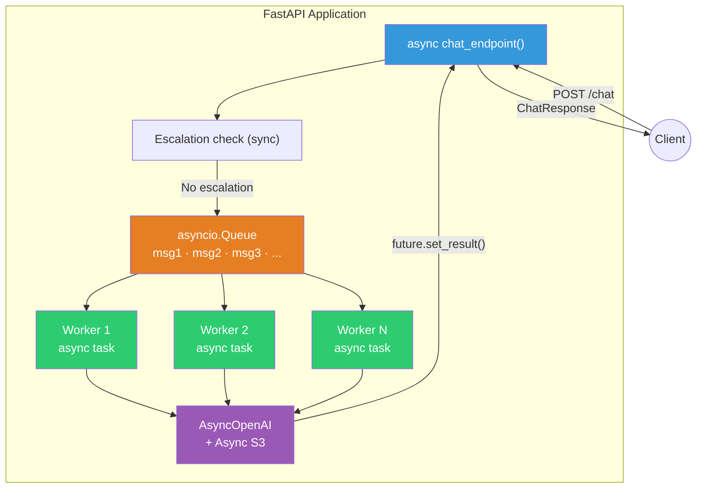

# ADR-008: Cola de mensajes en memoria con workers asíncronos

## Identificación

**Número**: ADR-008
**Fecha**: 2026-03-29
**Redactor**: Arte Chatbot Team
**Estado**: Propuesto

---

## Contexto

### Situación actual

El endpoint `/chat` procesa cada request de forma secuencial dentro de un thread del threadpool de FastAPI. No existe ningún mecanismo de cola, buffer o desacoplamiento entre la recepción del request y su procesamiento. Esto genera dos problemas:

1. **Saturación del threadpool**: Con ~40 threads y requests de 5-20s, el threadpool se agota bajo carga moderada, provocando rechazos de requests.
2. **Sin control de concurrencia LLM**: No hay límite en cuántas llamadas simultáneas se hacen a OpenAI, lo que puede exceder rate limits y generar errores 429.

Tras la migración a async I/O documentada en ADR-007, los clientes ya no bloquean threads, pero el endpoint aún procesa cada request de forma inline. Se necesita un mecanismo de **desacoplamiento** entre la recepción del request y su procesamiento.

### Fuerzas en juego

- **Múltiples clientes concurrentes**: El chatbot debe atender a varios clientes B2B simultáneamente. Cada conversación puede involucrar 2-3 llamadas a OpenAI (tool calling + análisis de ficha).
- **Naturaleza I/O-bound**: El 90%+ del tiempo de procesamiento es espera de red (OpenAI, S3). Las CPU están prácticamente ociosas.
- **Simplicidad del proyecto**: Es un proyecto académico con un equipo pequeño. Infraestructura pesada (Redis, Celery, RabbitMQ) añadiría complejidad injustificada.
- **Sesiones en memoria**: El sistema ya usa un patrón de almacenamiento en memoria (`SessionManager` con dict). La cola debe ser consistente con este enfoque.
- **Sin persistencia requerida**: Los messages no necesitan sobrevivir a un reinicio del servicio. Si el servicio cae, las sesiones se pierden de todas formas.

### Alcance

Esta decisión afecta a:
- `backend/app/queue.py` — Nuevo módulo con `ChatMessage` y `MessageQueue`
- `backend/main.py` — Lifespan events y endpoint que encola requests
- `backend/app/config.py` — Variables `queue_workers` y `max_queue_size`
- `docker-compose.yml` — Variables de entorno para workers

---

## Decisión

Vamos a implementar un sistema de **cola de mensajes en memoria** (`asyncio.Queue`) con un **pool de workers asíncronos** (`asyncio.Task`) que consumen requests de la cola y los procesan en paralelo, porque esto permite atender múltiples clientes simultáneamente sin infraestructura externa, manteniendo la simplicidad del proyecto.

### Arquitectura



### Componentes

#### `ChatMessage` — Unidad de trabajo

```python
from dataclasses import dataclass, field
import asyncio

@dataclass
class ChatMessage:
    """Mensaje encolado para procesamiento por un worker."""
    request_id: str
    session_id: str
    message: str
    future: asyncio.Future = field(
        default_factory=lambda: asyncio.get_event_loop().create_future()
    )
```

El `asyncio.Future` es el mecanismo de comunicación entre el worker y el endpoint: el endpoint hace `await msg.future` y el worker hace `msg.future.set_result(response)`.

#### `MessageQueue` — Orquestador

```python
class MessageQueue:
    def __init__(
        self,
        max_workers: int = 5,
        max_queue_size: int = 100,
        llm_client: LLMClient,
        s3_client: S3Client,
        file_inputs_client: FileInputsClient,
        session_manager: SessionManager,
    ):
        self.queue: asyncio.Queue[ChatMessage] = asyncio.Queue(maxsize=max_queue_size)
        self.max_workers = max_workers
        self._workers: list[asyncio.Task] = []
        # Referencias a clientes (inyectados, no creados internamente)

    async def start(self) -> None:
        """Crea y lanza max_workers tareas asyncio."""
        for i in range(self.max_workers):
            task = asyncio.create_task(self._worker(i), name=f"chat-worker-{i}")
            self._workers.append(task)

    async def stop(self) -> None:
        """Cancela todos los workers y espera su finalización."""
        for task in self._workers:
            task.cancel()
        await asyncio.gather(*self._workers, return_exceptions=True)
        self._workers.clear()

    async def enqueue(self, message: ChatMessage) -> None:
        """Encola un mensaje. Bloquea si la cola está llena (backpressure)."""
        await self.queue.put(message)
```

#### Worker — Loop de procesamiento

```python
async def _worker(self, worker_id: int) -> None:
    """Procesa mensajes de la cola indefinidamente."""
    logger.info("Worker %d started", worker_id)
    while True:
        try:
            msg = await self.queue.get()
            logger.debug("Worker %d processing: request_id=%s", worker_id, msg.request_id)
            try:
                response = await self._process_message(msg)
                if not msg.future.done():
                    msg.future.set_result(response)
            except Exception as e:
                logger.exception("Worker %d error: request_id=%s", worker_id, msg.request_id)
                if not msg.future.done():
                    msg.future.set_exception(e)
            finally:
                self.queue.task_done()
        except asyncio.CancelledError:
            logger.info("Worker %d cancelled", worker_id)
            break
```

#### Endpoint — Encolar y esperar

```python
@app.post("/chat", response_model=ChatResponse)
async def chat_endpoint(request: ChatRequest, api_key: str = Depends(verify_api_key)):
    session_id = request.session_id or str(uuid.uuid4())
    request_id = str(uuid.uuid4())

    # Escalation (no necesita cola, es O(1))
    escalation_result = default_detector.detect(request.message)
    if escalation_result.escalate:
        await session_manager.add_turn(...)
        return ChatResponse(response=DEFAULT_ESCALATION_MESSAGE, ...)

    # Encolar
    msg = ChatMessage(request_id=request_id, session_id=session_id, message=request.message)
    await app.state.queue_manager.enqueue(msg)

    # Esperar con timeout
    try:
        response = await asyncio.wait_for(msg.future, timeout=60.0)
        return response
    except asyncio.TimeoutError:
        raise HTTPException(status_code=504, detail="Request timeout")
```

### Lifespan events

```python
from contextlib import asynccontextmanager

@asynccontextmanager
async def lifespan(app: FastAPI):
    queue_manager = MessageQueue(
        max_workers=settings.queue_workers,
        max_queue_size=settings.max_queue_size,
        llm_client=llm_client,
        s3_client=s3_client,
        file_inputs_client=file_inputs_client,
        session_manager=session_manager,
    )
    await queue_manager.start()
    app.state.queue_manager = queue_manager
    yield
    await queue_manager.stop()

app = FastAPI(title="ARTE Chatbot Backend", lifespan=lifespan)
```

---

## Justificación

### Alternativas consideradas

#### 1. Redis + Celery

Sistema de cola distribuido con Redis como broker y Celery como framework de workers.

- **Pro**: Battle-tested, soporta persistencia de tasks, monitoreo con Flower, retry automático, rate limiting.
- **Contra**: Requiere un servicio Redis adicional en docker-compose. Celery tiene overhead significativo (~50MB por worker). Overkill para el volumen actual. No es nativo de asyncio (Celery usa su propio event loop).
- **Decisión**: Descartada por complejidad y sobrecarga. Justificada solo si el sistema necesita persistencia de tasks o múltiples instancias del backend.

#### 2. arq (async Redis queue)

Cola de tasks async basada en Redis, diseñada para asyncio.

- **Pro**: Nativo de asyncio, más ligero que Celery, API simple.
- **Contra**: Sigue requiriendo Redis como dependencia externa. Menos documentación y comunidad que Celery.
- **Decisión**: Descartada. Sigue añadiendo una dependencia externa (Redis) que no se justifica para el volumen actual.

#### 3. Procesamiento inline async (sin cola)

Hacer el endpoint `async def` pero procesar directamente sin cola ni workers.

- **Pro**: Máxima simplicidad. Sin cola, sin workers, sin management de lifecycle.
- **Contra**: Sin control de concurrencia. FastAPI ejecutaría todas las llamadas async en el mismo event loop, potencialmente excediendo rate limits de OpenAI con muchas requests simultáneas. Sin backpressure natural.
- **Decisión**: Válida para carga baja, pero la cola permite controlar la concurrencia (max_workers limita llamadas simultáneas a OpenAI).

#### 4. asyncio.Semaphore para limitar concurrencia

Usar un semáforo en lugar de una cola para limitar cuántos requests procesan en paralelo.

- **Pro**: Más simple que una cola. Un sempahoro de N permite N requests concurrentes.
- **Contra**: No hay buffer para requests excedentes. Si hay más de N requests, los adicionales se rechazan o el endpoint se bloquea. No permite ordenamiento FIFO ni métricas de queue depth.
- **Decisión**: Descartada. La cola ofrece más control y observabilidad.

### Criterios de decisión

1. **Simplicidad**: Sin infraestructura externa (Redis, RabbitMQ). Todo en memoria del proceso.
2. **Control de concurrencia**: `max_workers` limita las llamadas simultáneas a OpenAI, evitando rate limits.
3. **Backpressure**: `max_queue_size` permite que requests excedentes esperen en lugar de ser rechazados.
4. **Observabilidad**: Queue depth y worker status son visibles en logs.
5. **Consistencia con arquitectura existente**: El proyecto ya usa patrones en memoria (SessionManager). La cola sigue el mismo enfoque.
6. **Cero dependencias nuevas de runtime**: `asyncio.Queue`, `asyncio.Task`, y `asyncio.Future` son todos stdlib.

### Trade-offs aceptados

- **Sin persistencia**: Si el proceso cae, los mensajes en cola se pierden. Aceptable porque las sesiones también se pierden (SessionManager es en memoria).
- **Single-process**: La cola solo existe dentro de un proceso. No se puede distribuir entre múltiples instancias del backend. Para el despliegue actual (un contenedor), esto es suficiente.
- **Sin retry automático**: Si un worker falla procesando un mensaje, el error se propaga al cliente. No hay reintento automático. Mitigado con logging detallado y timeout en el endpoint.
- **Timeout hardcodeado**: El timeout de 60s en `asyncio.wait_for` es un valor fijo. Si una llamada a OpenAI toma más de 60s, el cliente recibe un 504. Mitigado: las llamadas típicas a OpenAI toman 2-8s, el timeout es un safety net.

---

## Consecuencias

### Positivas

- **Concurrencia real**: Hasta `max_workers` requests se procesan simultáneamente. Con `max_workers=5`, el throughput bajo carga mejora ~5x vs threadpool sync.
- **Control de concurrencia LLM**: El parámetro `max_workers` limita las llamadas simultáneas a OpenAI, evitando errores 429 por rate limiting.
- **Backpressure ordenado**: Requests excedentes esperan en la cola en orden FIFO, en lugar de ser rechazados con HTTP 503.
- **Observabilidad**: Se puede loggear queue depth, worker status, y métricas de procesamiento.
- **Sin dependencias externas**: Todo funciona con stdlib de Python. No se necesita Redis, RabbitMQ, ni servicios adicionales.
- **Consistente con la arquitectura existente**: El patrón en memoria es idéntico al de SessionManager.
- **Configurable por variable de entorno**: `QUEUE_WORKERS` y `MAX_QUEUE_SIZE` permiten ajustar sin cambiar código.

### Negativas

- **Complejidad adicional**: El flujo de request pasa de lineal (endpoint procesa directamente) a desacoplado (endpoint → cola → worker → future). Esto añade indirección al debugging.
- **Latencia mínima por enqueue/dequeue**: El overhead de `queue.put()` + `queue.get()` es <1ms, despreciable comparado con la latencia de OpenAI (~5s).
- **Memory footprint de workers**: Cada worker es un `asyncio.Task` (~32KB de overhead). Con 5 workers, ~160KB total. Despreciable.
- **Sin persistencia**: Cola en memoria no sobrevive reinicios. Aceptado dado que SessionManager tampoco persiste.

### Riesgos identificados

- **Riesgo**: Worker cuelga (deadlock, loop infinito) sin resolver el Future.
  **Mitigación**: `asyncio.wait_for(msg.future, timeout=60.0)` en el endpoint garantiza que el cliente no espera indefinidamente. Si el worker no resuelve el future en 60s, el cliente recibe HTTP 504.

- **Riesgo**: Memory leak si Futures no se resuelven (messages acumulados).
  **Mitigación**: Cada worker tiene `try/except` que garantiza `future.set_result()` o `future.set_exception()`. El `finally` llama `task_done()`.

- **Riesgo**: Cola crece indefinidamente bajo carga sostenida.
  **Mitigación**: `max_queue_size=100` limita el tamaño. `queue.put()` bloquea (backpressure) cuando la cola está llena, limitando el número de requests en espera.

- **Riesgo**: Un worker procesa un request lento y bloquea otros requests en la cola.
  **Mitigación**: Múltiples workers procesan en paralelo. Un worker lento no afecta a los demás. `max_workers` debe ser >= 2 para garantizar que un request largo no monopolice el sistema.

- **Riesgo**: `asyncio.CancelledError` durante shutdown deja workers en estado inconsistente.
  **Mitigación**: Workers capturan `CancelledError` explícitamente y hacen break del loop. `stop()` usa `return_exceptions=True` en `asyncio.gather`.

---

## Artefactos relacionados

- [US-ASYNC] Migrar backend a async con cola de mensajes
- [ADR-007: Migración a Async I/O con AsyncOpenAI](007.md) — Prerequisito
- [ADR-001: Arquitectura inicial y orquestación de servicios](001.md)
- [Python asyncio.Queue](https://docs.python.org/3/library/asyncio-queue.html)
- [FastAPI Lifespan Events](https://fastapi.tiangolo.com/advanced/events/)

---

## Notas adicionales

### Configuración recomendada

| Parámetro | Default | Entorno desarrollo | Entorno producción |
|---|---|---|---|
| `QUEUE_WORKERS` | 5 | 2-3 (OpenAI rate limit free tier) | 5-10 (según plan de OpenAI) |
| `MAX_QUEUE_SIZE` | 100 | 20 (pocos clientes) | 100-500 (muchos clientes) |

### Monitoreo

Se recomienda agregar métricas de observabilidad en una iteración futura:

- Queue depth actual (tamaño de la cola)
- Número de workers activos vs ociosos
- Tiempo promedio de procesamiento por worker
- Contador de timeouts

Estas métricas pueden implementarse con counters simples en la clase `MessageQueue` y exponerse en un endpoint `/metrics` o en logs estructurados.

### Escalabilidad futura

Si el sistema necesita escalar a múltiples instancias del backend, la cola en memoria debe reemplazarse por una cola distribuida (Redis, SQS). La abstracción `MessageQueue` está diseñada para facilitar esta migración: se puede cambiar la implementación de `enqueue()` y `_worker()` sin modificar el endpoint.

### Relación con ADR-006 (Loop Agentic)

ADR-006 define un loop agentic donde el LLM puede encadenar múltiples tool calls (`buscar_producto` → `leer_ficha_tecnica`). La cola de mensajes opera a un nivel superior: cada iteración del loop agentic ocurre dentro de un solo worker. El worker ejecuta el loop completo (posiblemente con múltiples llamadas LLM) antes de resolver el Future. Esto significa que un request que requiere 3 llamadas LLM mantiene el worker ocupado durante todo el procesamiento, lo cual es el comportamiento esperado.

### Consideración de rate limits de OpenAI

OpenAI impone rate limits por modelo (RPM — requests per minute, TPM — tokens per minute). Con `max_workers=5`, se hacen hasta 5 llamadas simultáneas a OpenAI. Si esto excede los rate limits:

1. OpenAI retorna HTTP 429
2. El SDK de OpenAI (`AsyncOpenAI`) tiene retry automático con backoff exponencial
3. Si persiste el error, el worker lo captura y propaga como `LLMServiceError` al Future
4. El endpoint retorna HTTP 503 al cliente

La configuración de `QUEUE_WORKERS` debe ajustarse según el plan de OpenAI del proyecto. Para el plan gratuito (tier 1), se recomienda `QUEUE_WORKERS=3`.
