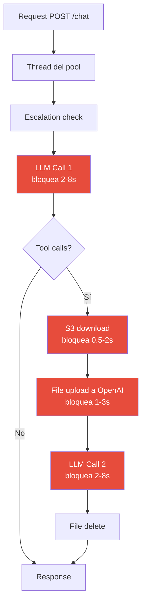
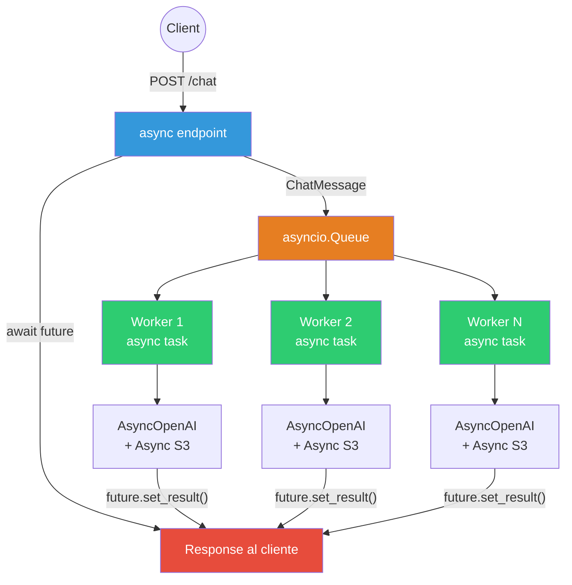
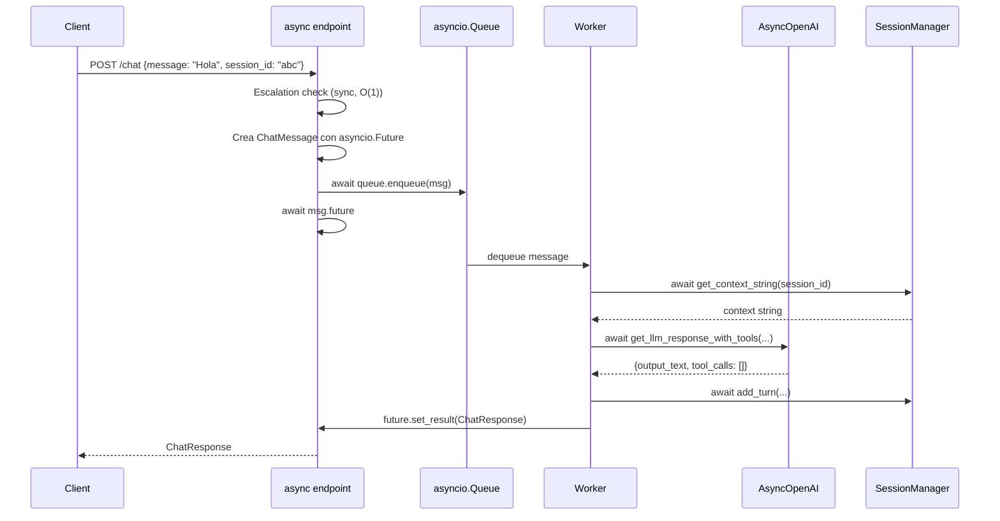
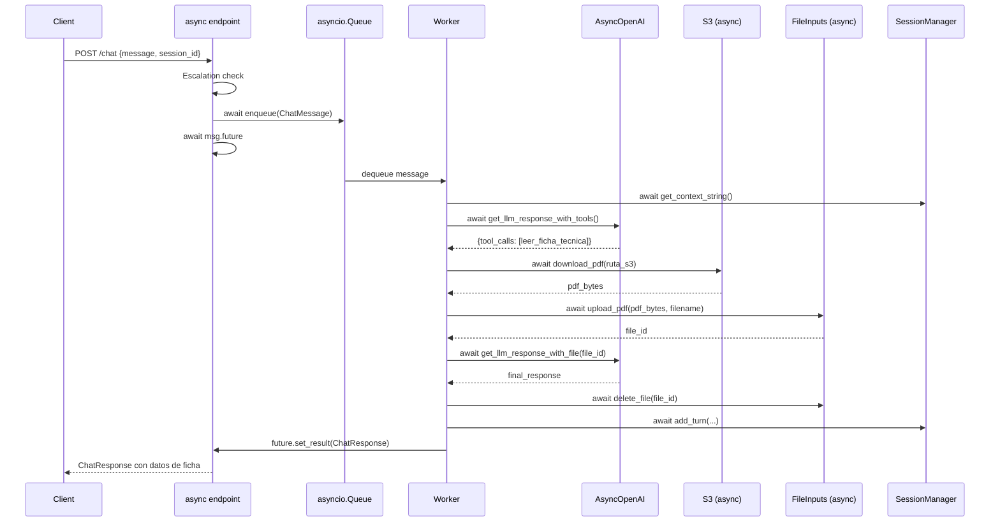
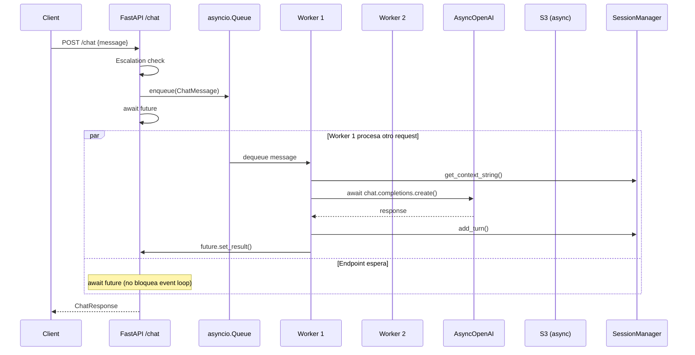

# Diseño: Cola de Mensajes y Workers Asíncronos para Arte Chatbot

## 1. Estado Actual del Backend

### Arquitectura Sincrónica (pre-migración)

El backend actual opera de forma **completamente sincrónica**:

| Componente | Implementación | Problema |
|---|---|---|
| Endpoint `/chat` | `def chat_endpoint()` (sync) | FastAPI delega a threadpool (~40 threads default). Bajo carga, se saturan. |
| `LLMClient` | `openai.OpenAI` (sync) | Bloquea el thread durante toda la llamada a OpenAI (~2-8s). |
| `FileInputsClient` | `openai.OpenAI` (sync) | Bloquea durante upload/delete de archivos. |
| `S3Client` | `boto3.client` (sync) | Bloquea durante descarga de PDFs. |
| `SessionManager` | `threading.Lock` | Correcto para threading, pero incompatible con asyncio. |

### Flujo actual (un request a la vez por thread)



**Tiempo total por request con tool call**: ~6-20 segundos de bloqueo de thread.

### Problemas identificados

1. **Saturación del threadpool**: Con ~40 threads default de FastAPI y requests de 6-20s, se alcanza el límite con poca carga concurrente.
2. **Sin aprovechamiento de I/O async**: Durante los ~10s promedio de espera de OpenAI, el thread está ocioso pero no puede atender otros requests.
3. **Sin cola ni backpressure**: No hay mecanismo para encolar requests excedentes; se rechazan cuando el threadpool se agota.
4. **Sin control de concurrencia LLM**: No hay límite en cuántas llamadas simultáneas se hacen a OpenAI, pudiendo exceder rate limits.

---

## 2. Arquitectura Propuesta

### Visión general

Migrar a un modelo **fully async** con cola de mensajes en memoria y pool de workers:



### Componentes nuevos

#### A. `backend/app/queue.py` — Sistema de cola y workers

```python
# Concepto (implementación detallada en Fase 3)

@dataclass
class ChatMessage:
    request_id: str
    session_id: str
    message: str
    future: asyncio.Future  # Para devolver la respuesta al endpoint

class MessageQueue:
    def __init__(self, max_workers: int = 5, max_queue_size: int = 100):
        self.queue: asyncio.Queue[ChatMessage] = asyncio.Queue(maxsize=max_queue_size)
        self.max_workers = max_workers
        self._workers: list[asyncio.Task] = []

    async def start(self):
        """Iniciar los workers al arrancar la aplicación."""

    async def stop(self):
        """Cancelar workers al detener la aplicación."""

    async def enqueue(self, msg: ChatMessage):
        """Encolar un mensaje (bloquea si la cola está llena)."""

    async def _worker(self, worker_id: int):
        """Loop principal del worker: consume mensajes de la cola."""
```

**Decisiones de diseño**:
- `asyncio.Queue` en memoria (sin Redis/Celery): alineado con la simplicidad del proyecto y el patrón existente de sesiones en memoria.
- `max_queue_size=100`: backpressure implícito. Si la cola está llena, el endpoint espera (no rechaza).
- Workers como `asyncio.Task`: se crean al startup de FastAPI con lifespan events.
- `asyncio.Future` como mecanismo de respuesta: el endpoint hace `await future` y el worker hace `future.set_result()`.

#### B. `backend/app/llm_client.py` — Migración a AsyncOpenAI

```python
# Cambio de:
self._openai_client: Optional[OpenAI] = None
# A:
self._openai_client: Optional[AsyncOpenAI] = None

# Métodos pasan de:
def get_llm_response_with_tools(self, ...) -> dict:
    response = self.openai_client.chat.completions.create(...)
# A:
async def get_llm_response_with_tools(self, ...) -> dict:
    response = await self.openai_client.chat.completions.create(...)
```

**Impacto**: Cambio de `openai.OpenAI` a `openai.AsyncOpenAI`. Los métodos se convierten en `async def` y las llamadas usan `await`. La API del SDK es idéntica entre sync y async.

#### C. `backend/app/file_inputs.py` — Migración a AsyncOpenAI

```python
# Mismo patrón que LLMClient:
self._client: Optional[AsyncOpenAI] = None

async def upload_pdf(self, pdf_bytes: bytes, filename: str) -> str:
    response = await self.client.files.create(...)

async def delete_file(self, file_id: str) -> None:
    await self.client.files.delete(file_id)
```

#### D. `backend/app/s3_client.py` — Async con `asyncio.to_thread`

```python
# Opción elegida: mantener boto3 sync y envolver con asyncio.to_thread()
# No requiere nueva dependencia (aioboto3), mantiene compatibilidad total.

async def download_pdf(self, s3_key: str) -> bytes:
    return await asyncio.to_thread(self._download_pdf_sync, s3_key)

def _download_pdf_sync(self, s3_key: str) -> bytes:
    # Lógica actual de boto3 sin cambios
    ...
```

**Justificación**: Las operaciones S3 son rápidas (~100-500ms). `asyncio.to_thread()` es suficiente y evita agregar `aioboto3` como dependencia. Si en el futuro se necesita mayor control sobre connection pooling S3, se puede migrar a `aioboto3`.

#### E. `backend/app/session.py` — Migración a `asyncio.Lock`

```python
# Cambio de:
self._lock = threading.Lock()
# A:
self._lock = asyncio.Lock()

# Métodos que usan el lock pasan a async:
async def add_turn(self, ...) -> None:
    async with self._lock:
        ...
```

#### F. `backend/main.py` — Endpoint async + lifespan

```python
from contextlib import asynccontextmanager

@asynccontextmanager
async def lifespan(app: FastAPI):
    """Startup/shutdown del sistema de workers."""
    queue_manager = MessageQueue(max_workers=settings.queue_workers)
    await queue_manager.start()
    app.state.queue_manager = queue_manager
    yield
    await queue_manager.stop()

app = FastAPI(title="ARTE Chatbot Backend", lifespan=lifespan)

@app.post("/chat", response_model=ChatResponse)
async def chat_endpoint(request: ChatRequest, api_key: str = Depends(verify_api_key)):
    # Escalation check (sync, sin cambio)
    # Crear ChatMessage con asyncio.Future
    # Encolar en app.state.queue_manager
    # await future (el worker resuelve)
    # Guardar en sesión
    # Retornar respuesta
```

#### G. `backend/app/config.py` — Nuevas variables

```python
queue_workers: int = Field(default=5, description="Number of async queue workers")
max_queue_size: int = Field(default=100, description="Maximum queue size before backpressure")
```

#### H. `docker-compose.yml` — Variable de entorno

```yaml
environment:
  - QUEUE_WORKERS=5
  - MAX_QUEUE_SIZE=100
```

---

## 3. Flujo de Datos Detallado

### Request con respuesta directa (sin tool call)



### Request con tool call (ficha técnica)



### Concurrencia real

Con `max_workers=5`, hasta 5 requests se procesan simultáneamente:

```mermaid
gantt
    title Concurrencia con max_workers=5
    dateFormat X
    axisFormat %s

    section Worker 1
    Request A (LLM 5s)          :w1, 0, 5
    Request F (LLM 4s)          :w1f, 5, 9

    section Worker 2
    Request B (LLM 4s)          :w2, 1, 5

    section Worker 3
    Request C (LLM 6s)          :w3, 2, 8

    section Worker 4
    Request D (LLM 5s)          :w4, 3, 8

    section Worker 5
    Request E (LLM 5s)          :w5, 4, 9

    section Cola
    Request F espera            :crit, done, 4, 5
```



---

## 4. Plan de Implementación por Fases

### Fase 1: Configuración y dependencias
**Objetivo**: Preparar el entorno sin romper funcionalidad existente.

| Paso | Archivo | Cambio |
|---|---|---|
| 1.1 | `pyproject.toml` | Agregar `pytest-asyncio>=0.23.0` a dev dependencies |
| 1.2 | `backend/app/config.py` | Agregar campos `queue_workers: int` y `max_queue_size: int` |
| 1.3 | `.env.example` | Agregar `QUEUE_WORKERS=5` y `MAX_QUEUE_SIZE=100` |

**Criterio de completitud**: Tests existentes pasan sin cambios. Las nuevas config se leen correctamente.

---

### Fase 2: Migración de clientes a async
**Objetivo**: Convertir los 3 clientes (LLM, FileInputs, S3) a async.

| Paso | Archivo | Cambio |
|---|---|---|
| 2.1 | `backend/app/llm_client.py` | `OpenAI` → `AsyncOpenAI`, métodos a `async def`, `await` en llamadas |
| 2.2 | `backend/app/file_inputs.py` | `OpenAI` → `AsyncOpenAI`, `upload_pdf` y `delete_file` a `async def` |
| 2.3 | `backend/app/s3_client.py` | Agregar `async download_pdf()` con `asyncio.to_thread()`, mantener sync como `_download_pdf_sync()` |
| 2.4 | `backend/tests/test_llm_client.py` | Migrar tests a `pytest-asyncio`, usar `AsyncMock` |
| 2.5 | `backend/tests/test_file_inputs.py` | Migrar tests a `pytest-asyncio` |
| 2.6 | `backend/tests/test_s3_client.py` | Agregar tests para métodos async |

**Criterio de completitud**: Todos los tests pasan (tanto los existentes adaptados como los nuevos).

---

### Fase 3: Sistema de cola y workers
**Objetivo**: Implementar el motor de cola y workers.

| Paso | Archivo | Cambio |
|---|---|---|
| 3.1 | `backend/app/queue.py` | Nuevo archivo: `ChatMessage` dataclass, `MessageQueue` class con workers |
| 3.2 | `backend/tests/test_queue.py` | Tests unitarios: enqueue/dequeue, worker lifecycle, backpressure, error handling |

**Criterio de completitud**: La cola funciona independientemente (tests aislados). Workers inician y detienen correctamente.

---

### Fase 4: Migración de session manager a async
**Objetivo**: Hacer SessionManager compatible con asyncio.

| Paso | Archivo | Cambio |
|---|---|---|
| 4.1 | `backend/app/session.py` | `threading.Lock` → `asyncio.Lock`, métodos a `async def` |
| 4.2 | `backend/tests/test_session.py` | Migrar tests a `pytest-asyncio` |

**Criterio de completitud**: Tests de sesión pasan con el nuevo locking async.

---

### Fase 5: Integración en el endpoint
**Objetivo**: Conectar todo en `/chat` y eliminar el flujo sync.

| Paso | Archivo | Cambio |
|---|---|---|
| 5.1 | `backend/main.py` | Agregar `lifespan` con startup/shutdown de workers |
| 5.2 | `backend/main.py` | Convertir `chat_endpoint` a `async def`, integrar cola |
| 5.3 | `backend/main.py` | Migrar `_process_tool_call` a `async def` |
| 5.4 | `backend/tests/test_chat.py` | Migrar tests a `pytest-asyncio`, usar `httpx.AsyncClient` |
| 5.5 | `docker-compose.yml` | Agregar `QUEUE_WORKERS` y `MAX_QUEUE_SIZE` a environment |

**Criterio de completitud**: El endpoint `/chat` funciona con la nueva arquitectura. Tests de integración pasan.

---

### Fase 6: Validación end-to-end
**Objetivo**: Verificar el sistema completo bajo carga.

| Paso | Acción |
|---|---|
| 6.1 | Ejecutar `docker compose up -d` y verificar health check |
| 6.2 | Enviar requests concurrentes (5 simultáneos) y verificar que se procesan en paralelo |
| 6.3 | Verificar que las métricas de workers/logs muestran concurrencia real |
| 6.4 | Verificar que el backpressure funciona (enviar >max_queue_size requests) |
| 6.5 | Ejecutar `pytest` completo — todos los tests pasan |
| 6.6 | Ejecutar `ruff check` y `mypy` — sin errores |

---

## 5. Recursos Necesarios

### Dependencias nuevas

| Paquete | Propósito | Categoría |
|---|---|---|
| `pytest-asyncio>=0.23.0` | Testing de código async | dev |

**No se agregan dependencias de runtime nuevas.** El SDK `openai` ya incluye `AsyncOpenAI`. Las operaciones S3 se envuelven con `asyncio.to_thread()` (stdlib).

### Variables de entorno nuevas

| Variable | Default | Descripción |
|---|---|---|
| `QUEUE_WORKERS` | `5` | Número de workers concurrentes |
| `MAX_QUEUE_SIZE` | `100` | Tamaño máximo de la cola antes de backpressure |

### Archivos nuevos

| Archivo | Líneas estimadas |
|---|---|
| `backend/app/queue.py` | ~120 |
| `backend/tests/test_queue.py` | ~150 |

### Archivos modificados

| Archivo | Tipo de cambio |
|---|---|
| `backend/app/llm_client.py` | Migración sync → async |
| `backend/app/file_inputs.py` | Migración sync → async |
| `backend/app/s3_client.py` | Wrapper async |
| `backend/app/session.py` | threading.Lock → asyncio.Lock |
| `backend/app/config.py` | Nuevos campos de configuración |
| `backend/main.py` | Endpoint async + lifespan + cola |
| `pyproject.toml` | pytest-asyncio |
| `.env.example` | Nuevas variables |
| `docker-compose.yml` | Nuevas variables de entorno |

---

## 6. Riesgos y Mitigaciones

| Riesgo | Impacto | Mitigación |
|---|---|---|
| Deadlock si worker falla sin resolver Future | Request colgado eternamente | `try/except` en worker que hace `future.set_exception()` en caso de error |
| Memory leak si Futures no se resuelven | Crecimiento de memoria | Timeout en `await future` (ej: 60s) con `asyncio.wait_for()` |
| Cola llena bajo carga alta | Requests rechazados o timeout | Configurar `max_queue_size` adecuado. Logging de queue depth. |
| Incompatibilidad con tests existentes | Tests rotos tras migración | Migrar tests por fase. Usar `pytest-asyncio` y `AsyncMock`. |
| OpenAI rate limits bajo concurrencia | Errores 429 | Respetar `max_workers`. Agregar retry con backoff en workers si es necesario. |
| Sesiones corruptas bajo concurrencia | Datos inconsistentes | `asyncio.Lock` protege operaciones de escritura. Lecturas sin lock son seguras (dict de Python es thread-safe para reads en CPython). |

---

## 7. Métricas de éxito

| Métrica | Antes (sync) | Después (async) |
|---|---|---|
| Requests concurrentes máximas | ~40 (limitado por threads) | `max_workers` × N (limitado por event loop) |
| Throughput bajo carga (10 req simultáneos) | ~1-2 req/s (threadpool saturado) | ~3-5 req/s (workers paralelos) |
| Latencia de un request aislado | ~5-15s | ~5-15s (sin cambio, misma llamada OpenAI) |
| Uso de memoria por request concurrente | ~5-10 MB/thread | ~0.1 MB/coroutine |
| Backpressure | HTTP 503 al saturar threadpool | Cola con espera ordenada |

---

## 8. Diagrama de secuencia final


