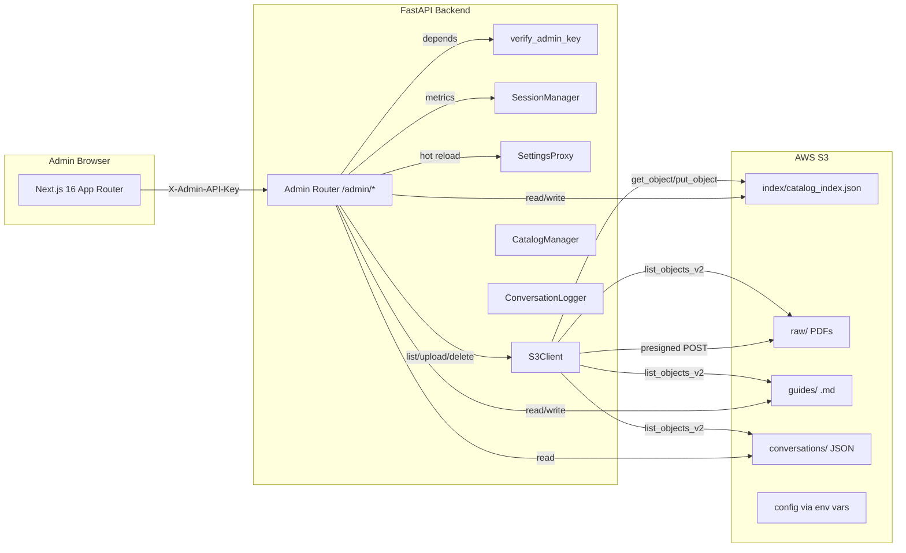
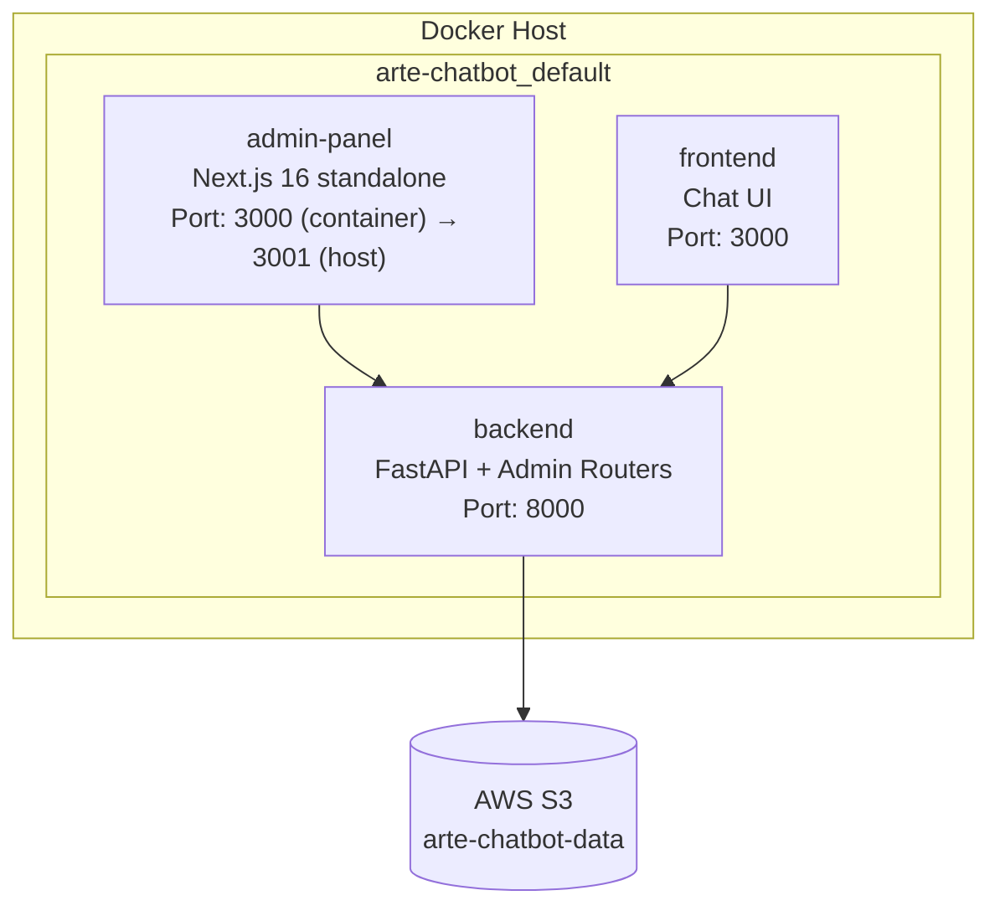
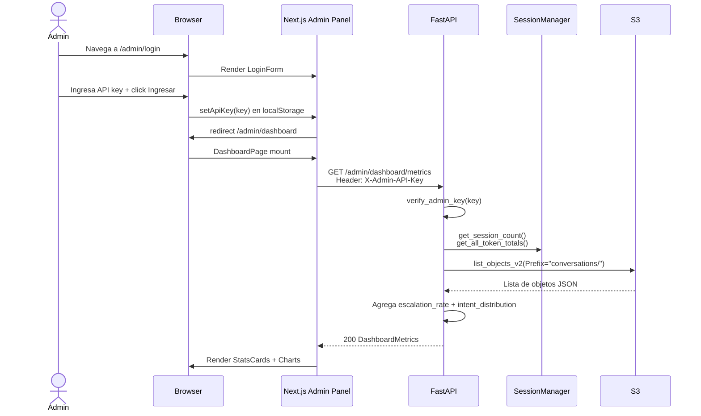
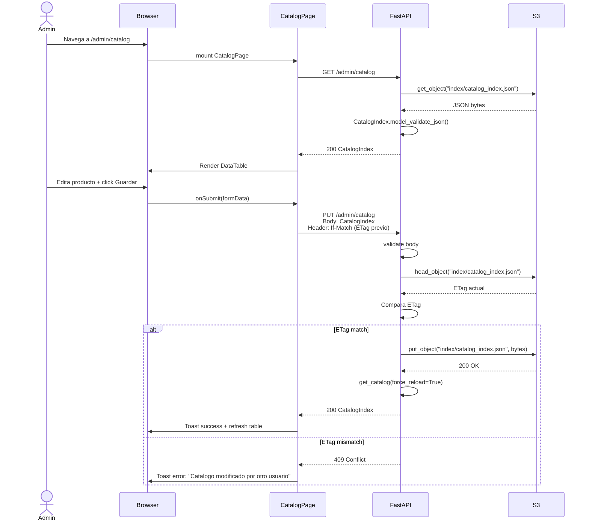
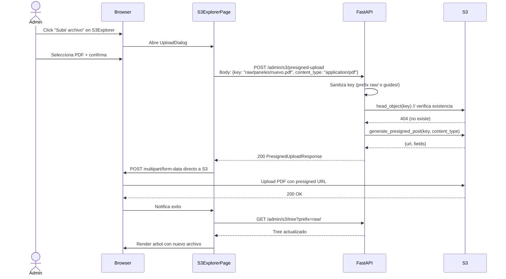
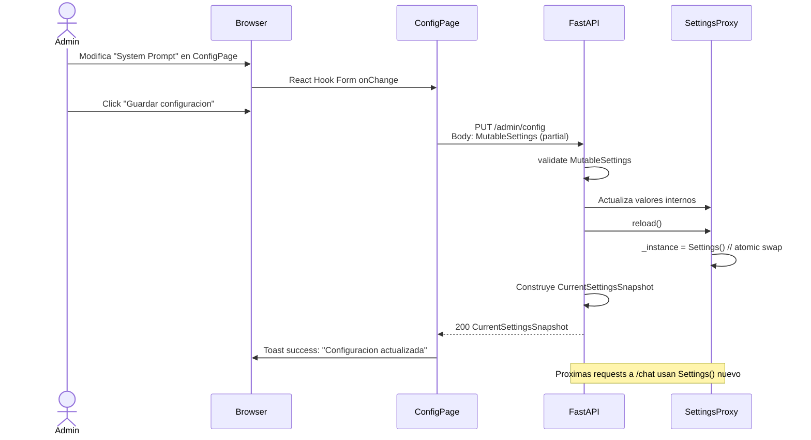

# Design: Admin Panel MVP

> **Artifact**: `openspec/changes/admin-panel-mvp/design.md`  
> **Change**: admin-panel-mvp  
> **Format**: OpenSpec delta design  
> **Standard**: RFC 2119 (MUST / SHALL / SHOULD / MAY)

---

## 1. Arquitectura de Alto Nivel

### 1.1 Flujo de Datos



### 1.2 Diagrama de Despliegue



### 1.3 Separacion de Responsabilidades

| Capa | Responsabilidad | Tecnologia |
|------|----------------|------------|
| **Frontend** | UI/UX, formularios, tablas, charts, routing client-side, auth guard. Nunca toca S3 directamente salvo presigned POST. | Next.js 16, React, Tailwind, shadcn/ui |
| **Backend** | Auth, validacion Pydantic, orquestacion de S3, agregacion de metricas, hot reload de settings. | FastAPI, Python 3.11 |
| **S3** | Fuente de verdad para catalogo, fichas tecnicas, guias markdown, logs de conversacion. | AWS S3 via boto3 |

---

## 2. Diseno del Backend (FastAPI)

### 2.1 Estructura de Modulos

#### Archivos Nuevos

| Archivo | Responsabilidad |
|---------|----------------|
| `backend/app/admin_router.py` | Router principal `APIRouter(prefix="/admin")` que agrupa todos los sub-routers via `include_router`. |
| `backend/app/admin_schemas.py` | Modelos Pydantic v2 del dominio admin: `CatalogIndex`, `GuideMeta`, `DashboardMetrics`, `MutableSettings`, `S3TreeNode`, etc. |
| `backend/app/admin_auth.py` | `verify_admin_key` dependency usando `APIKeyHeader(name="X-Admin-API-Key")` y `hmac.compare_digest`. |
| `backend/app/admin_dashboard.py` | Endpoints `GET /admin/dashboard/metrics`. Agrega datos de `SessionManager` + scan S3 `conversations/`. |
| `backend/app/admin_s3.py` | Endpoints `GET /admin/s3/tree`, `POST /admin/s3/presigned-upload`, `DELETE /admin/s3/objects`. |
| `backend/app/admin_catalog.py` | Endpoints `GET /admin/catalog`, `PUT /admin/catalog` con ETag optimistic locking. |
| `backend/app/admin_guides.py` | Endpoints `GET /admin/guides`, `GET /admin/guides/{intent}`, `PUT /admin/guides/{intent}`, `DELETE /admin/guides/{intent}`. |
| `backend/app/admin_config.py` | Endpoints `GET /admin/config`, `PUT /admin/config`. Expone snapshot mutable/inmutable. |
| `backend/app/admin_logs.py` | Endpoints `GET /admin/logs`, `GET /admin/logs/{session_id}`. Filtrado + paginacion en memoria. |

#### Archivos Modificados

| Archivo | Cambios |
|---------|---------|
| `backend/app/auth.py` | Agregar `ADMIN_API_KEY_HEADER` y `verify_admin_key()`; reutilizar `hmac.compare_digest` del patron existente. |
| `backend/app/config.py` | Agregar campo `admin_api_key: Optional[str]`. Agregar metodo `reload()` a `_SettingsProxy` que cree nueva instancia `Settings()` y la swappee atomicamente. |
| `backend/app/s3_client.py` | Agregar `list_objects()`, `delete_object()`, `delete_objects()`, `generate_presigned_post()`, `head_object()`. |
| `backend/app/catalog.py` | Agregar `save_catalog(index_data: dict, etag: Optional[str])` y `reload_catalog()`. `get_catalog(force_reload=True)` ya existe; expandir su uso. |
| `backend/app/session.py` | Agregar `get_all_token_totals()`, `get_intent_distribution()`, `get_escalation_rate()` para agregacion de metricas. |
| `backend/app/conversation_logger.py` | Agregar `list_logs(filters)`, `get_log(session_id)` para lectura desde S3 prefix `conversations/`. |
| `backend/main.py` | Importar y montar `admin_router` con `app.include_router(admin_router, prefix="/admin")`. Agregar origen `http://localhost:3001` a `CORSMiddleware`. |

### 2.2 Diagrama de Clases / Protocolos

```text
┌──────────────────────┐
│   AdminAuthDep       │  ← dependency
│   verify_admin_key() │     returns str (the key)
└──────────┬───────────┘
           │ injected into every admin endpoint
┌──────────▼───────────┐     ┌──────────────────────┐
│   S3Client           │     │   SettingsProxy      │
│   + list_objects()   │     │   + reload()         │
│   + delete_object()  │     │   + get_snapshot()   │
│   + delete_objects() │     │   - _instance swap   │
│   + generate_presigned_post()     └──────────┬───────────┘
│   + head_object()    │                       │
│   + put_object()     │                       │
└──────────┬───────────┘                       │
           │                                   │
┌──────────▼───────────┐     ┌─────────────────┴──────────┐
│ SessionManager       │     │   CatalogManager           │
│ + get_session_count()│     │   + save_catalog()         │
│ + get_all_token_totals()    │   + reload_catalog()       │
│ + get_intent_distribution() │   - get_catalog(force=True)│
│ + get_escalation_rate()     └────────────────────────────┘
└──────────┬───────────┘
           │
┌──────────▼───────────┐
│ ConversationLogger   │
│ + list_logs()        │
│ + get_log(session_id)│
└──────────────────────┘
```

**Tipos de retorno clave:**
- `verify_admin_key` → `str` (la API key validada).
- `S3Client.list_objects(prefix)` → `List[Dict[str, Any]]` (raw boto3 Contents).
- `S3Client.generate_presigned_post(...)` → `Dict[str, Any]` (url, fields).
- `SessionManager.get_all_token_totals()` → `Dict[str, TokenTotals]`.
- `SettingsProxy.reload()` → `None` (side effect: atomic swap).

### 2.3 Flujos de Datos Detallados

#### Dashboard
1. `GET /admin/dashboard/metrics` recibe request con `X-Admin-API-Key`.
2. `verify_admin_key` valida contra `settings.admin_api_key`.
3. Endpoint llama `session_manager.get_session_count()` y `get_all_token_totals()`.
4. Para escalation rate e intent distribution: escanea S3 prefix `conversations/` (ultimas 24h), parsea JSONs, agrega. Si >1000 objetos, usa sampling o cached aggregate.
5. Construye `DashboardMetrics` y responde 200.

#### S3 Explorer
1. `GET /admin/s3/tree?prefix=raw/` → valida prefix (no `..`, no absoluto).
2. `s3_client.list_objects(prefix=prefix)` devuelve lista plana de boto3.
3. Backend construye arbol jerarquico dividiendo `Key` por `/`.
4. Serializa a `List[S3TreeNode]` y responde.

#### Catalog CRUD
1. `GET /admin/catalog` → `s3_client.download_pdf("index/catalog_index.json")` (o nuevo `get_object`).
2. Parsea bytes a dict, valida con `CatalogIndex` Pydantic, responde.
3. `PUT /admin/catalog` → valida body `CatalogIndex`.
4. (Optimistic locking) Si header `If-Match` presente, compara ETag via `head_object`.
5. Si mismatch → 409 Conflict.
6. Serializa a JSON bytes, `s3_client.put_object(key="index/catalog_index.json", data=bytes)`.
7. Invalida cache: `get_catalog(force_reload=True)`.
8. Responde con catalogo guardado.

#### Guides
1. `GET /admin/guides` → `list_objects(prefix="guides/")`, filtra `.md`, extrae `intent` de filename.
2. `GET /admin/guides/{intent}` → sanitiza intent (regex `^[a-zA-Z0-9_-]+$`), descarga `guides/{intent}.md`.
3. `PUT /admin/guides/{intent}` → valida body `GuideContent`, sanitiza intent, `put_object` con `content_type="text/markdown"`.
4. `DELETE /admin/guides/{intent}` → `head_object` para verificar existencia, luego `delete_object`.

#### Config (Hot Reload)
1. `GET /admin/config` → lee `settings` proxy, divide en `MutableSettings` e `ImmutableSettings`, responde `CurrentSettingsSnapshot`.
2. `PUT /admin/config` → valida body `MutableSettings` (partial updates permitidos).
3. Actualiza variables de entorno internas o estado del proxy.
4. Llama `settings.reload()` → crea nueva instancia `Settings()`, asigna a `_instance`.
5. Responde nuevo snapshot.

#### Logs
1. `GET /admin/logs` → `list_objects(prefix="conversations/")` paginado.
2. Filtra en memoria por `date_from`, `date_to`, `intent_type`, `escalated`.
3. Agrupa por `session_id`, resume en `ConversationLogSummary`.
4. Aplica `limit`/`offset`.
5. `GET /admin/logs/{session_id}` → lista objetos bajo `conversations/{session_id}/`, descarga cada JSON, parsea `ConversationLogEntry`, ordena por `turn_number`.

### 2.4 Manejo de Errores y Seguridad

- **Auth**: `hmac.compare_digest(admin_key, valid_key)` para evitar timing attacks. Retorna 401 (missing), 403 (invalid), 503 (not configured).
- **Sanitizacion S3**: Regex `^[a-zA-Z0-9_\-/]+(\.[a-zA-Z0-9]+)?$`. Rechaza `..`, paths absolutos (`/`), y prefijos no permitidos (`raw/`, `guides/`, `index/` solo para escritura).
- **Optimistic Locking Catalog**: Cliente envia `If-Match` con ETag previo. Backend hace `head_object` antes de `put_object`. Mismatch → 409.
- **Rate Limiting**: No en MVP. En v2 se puede agregar `slowapi` con limites por IP/admin key.

---

## 3. Diseno del Frontend (Next.js 16)

### 3.1 Arquitectura de Componentes

```text
AdminLayout (app/admin/layout.tsx)
├── Sidebar (navegacion fija)
├── Header (titulo + logout)
├── AuthGuard (redirect a /admin/login si no hay key)
└── children
    ├── DashboardPage (app/admin/dashboard/page.tsx)
    │   ├── StatsCards
    │   ├── IntentChart (Recharts Pie)
    │   └── EscalationChart (Recharts Line)
    ├── CatalogPage (app/admin/catalog/page.tsx)
    │   ├── DataTable<CatalogProduct>
    │   └── ProductFormDialog
    ├── GuidesPage (app/admin/guides/page.tsx)
    │   └── DataTable<GuideMeta>
    ├── GuideEditorPage (app/admin/guides/[intent]/page.tsx)
    │   ├── MarkdownEditor (@uiw/react-md-editor)
    │   └── MarkdownPreview (react-markdown)
    ├── S3ExplorerPage (app/admin/s3-explorer/page.tsx)
    │   ├── S3Tree (recursivo + shadcn Collapsible)
    │   ├── UploadDialog
    │   └── DeleteConfirmDialog
    ├── ConfigPage (app/admin/config/page.tsx)
    │   └── ConfigForm (React Hook Form + Zod)
    ├── EscalationPage (app/admin/escalation/page.tsx)
    │   └── EscalationForm (slider + tag input)
    └── LogsPage (app/admin/logs/page.tsx)
        ├── DataTable<ConversationLogSummary>
        ├── LogFilterBar
        └── LogDetailDrawer (ChatTranscript)
```

### 3.2 Capa de API / State

#### `lib/api.ts` — TanStack Query Hooks

```typescript
// Ejemplo de hook pattern para cada recurso
export function useDashboardMetrics() {
  return useQuery({
    queryKey: ["admin", "dashboard", "metrics"],
    queryFn: async () => {
      const res = await fetch(`${API_URL}/admin/dashboard/metrics`, {
        headers: { "X-Admin-API-Key": getAdminKey() },
      });
      if (!res.ok) throw new Error(await res.text());
      return res.json() as Promise<DashboardMetrics>;
    },
    staleTime: 30_000,
  });
}

// Mutations invalidan cache tras exito
export function useUpdateCatalog() {
  const queryClient = useQueryClient();
  return useMutation({
    mutationFn: async (data: CatalogIndex) => { ... },
    onSuccess: () => {
      queryClient.invalidateQueries({ queryKey: ["admin", "catalog"] });
      toast.success("Catalogo guardado");
    },
  });
}
```

#### `lib/types.ts` — TypeScript Interfaces

Mapeo 1:1 desde Pydantic v2 a TypeScript/Zod:
- `CatalogProduct`, `CatalogIndex`, `GuideMeta`, `GuideContent`
- `DashboardMetrics`, `ConversationLogSummary`, `ConversationLogEntry`
- `MutableSettings`, `CurrentSettingsSnapshot`, `S3TreeNode`
- `PresignedUploadRequest`, `PresignedUploadResponse`

#### Estrategia de Fetching: Server vs Client Components

- **Server Components**: Practicamente ninguna pagina admin sera Server Component porque requieren auth dinamica (API key en `localStorage`, no cookie) y mutaciones interactivas. El `AdminLayout` puede ser un Server Component que envuelve un Client Component para el auth guard.
- **Client Components**: Todas las paginas bajo `app/admin/*` usan `"use client"` + TanStack Query para fetching, caching y mutaciones.

#### Estrategia de Cache

- `staleTime`: 30s para metricas, 60s para catalogo/config, 0 para logs.
- `cacheTime` (gcTime en v5): 5 minutos para datos pesados.
- Invalidacion manual post-mutacion: `queryClient.invalidateQueries({ queryKey: ["admin", "catalog"] })`.

### 3.3 Autenticacion y Routing

#### `AdminAuthProvider` (providers/admin-auth-provider.tsx)

```typescript
interface AdminAuthContextType {
  apiKey: string | null;
  setApiKey: (key: string) => void;
  logout: () => void;
  isAuthenticated: boolean;
}
```

- Lee `arte_admin_key` de `localStorage` en `useEffect` (mount del cliente).
- Expone `setApiKey` que persiste en `localStorage` y actualiza estado React.
- `logout` limpia `localStorage`, invalida `QueryClient`, redirige a `/admin/login`.

#### `useAdminAuth()` Hook

Consumer del contexto. Usado por `queryFn` para inyectar header dinamicamente.

#### Auth Guard

- `app/admin/layout.tsx`: Client Component que consume `useAdminAuth()`. Si `!isAuthenticated`, `router.replace("/admin/login")`.
- `app/admin/login/page.tsx`: Client Component. Si `isAuthenticated`, redirige a `/admin/dashboard`.

#### Middleware `middleware.ts`

```typescript
// Recomendado para evitar flash de contenido no autenticado
import { NextResponse } from "next/server";
import type { NextRequest };

export function middleware(request: NextRequest) {
  const adminKey = request.cookies.get("arte_admin_key")?.value;
  // Nota: localStorage no es accesible en middleware.
  // Opcion A: Duplicar key en cookie (mas seguro con httpOnly en v2).
  // Opcion B: Dejar el guard en layout.tsx y aceptar el flash.
  // Decision MVP: Sin middleware para auth; guard 100% en layout.tsx.
}
```

> **Nota de arquitectura**: En MVP no usamos `middleware.ts` para proteccion de auth porque `localStorage` no esta disponible en el edge. El guard en `layout.tsx` es suficiente. En v2, se puede migrar a cookie `httpOnly` + middleware.

### 3.4 Manejo de Formularios

#### Zod Schemas (`lib/schemas.ts`)

```typescript
import { z } from "zod";

export const CatalogProductSchema = z.object({
  nombre_comercial: z.string().min(1).max(200),
  fabricante: z.string().min(1).max(100),
  categoria: z.string().min(1).max(50),
  subcategoria: z.string().max(50).optional(),
  descripcion: z.string().max(2000).optional(),
  ruta_s3: z.string().regex(/^[a-zA-Z0-9_\-/]+\.[a-zA-Z0-9]+$/),
  variantes: z.array(
    z.object({
      modelo: z.string().min(1),
      parametros_clave: z.record(z.any()).default({}),
    })
  ).default([]),
  parametros_comunes: z.record(z.any()).default({}),
});

export const MutableSettingsSchema = z.object({
  llm_model: z.string().optional(),
  escalation_confidence_threshold: z.number().min(0).max(1).optional(),
  // ... resto de campos con mismos constraints que Pydantic
}).refine((data) => {
  if (data.msg_delay_min_ms && data.msg_delay_max_ms) {
    return data.msg_delay_min_ms <= data.msg_delay_max_ms;
  }
  return true;
}, { message: "min debe ser <= max" });
```

#### React Hook Form Integration

```typescript
const form = useForm<MutableSettings>({
  resolver: zodResolver(MutableSettingsSchema),
  defaultValues: configSnapshot.mutable,
});
```

- Validacion server-side reflejada en cliente: mismos limites numericos, regex de S3 keys, etc.
- Errores 422 de FastAPI se mapean a campos individuales via `form.setError`.

### 3.5 Styling y Temas

- **Base**: Tailwind CSS (requerido por shadcn/ui).
- **Layout admin**: Sidebar fijo de 240px (`w-60`), contenido scrollable (`flex-1 overflow-auto`).
- **Responsive**: En mobile (<768px), sidebar colapsa a drawer (`Sheet` de shadcn/ui) activado por hamburger menu.
- **Dark mode**: Documentado como post-MVP. `next-themes` se puede instalar pero no es prioridad. Los componentes de shadcn/ui ya soportan `dark` class.

---

## 4. Diseno de Infraestructura y Despliegue

### 4.1 Docker

#### `admin-panel/Dockerfile`

```dockerfile
# syntax=docker/dockerfile:1
FROM node:20-alpine AS base

FROM base AS deps
RUN apk add --no-cache libc6-compat
WORKDIR /app
COPY package.json package-lock.json* pnpm-lock.yaml* ./
RUN npm ci

FROM base AS builder
WORKDIR /app
COPY --from=deps /app/node_modules ./node_modules
COPY . .
ENV NEXT_TELEMETRY_DISABLED=1
RUN npm run build

FROM base AS runner
WORKDIR /app
ENV NODE_ENV=production
ENV NEXT_TELEMETRY_DISABLED=1
RUN addgroup --system --gid 1001 nodejs
RUN adduser --system --uid 1001 nextjs
COPY --from=builder /app/public ./public
COPY --from=builder --chown=nextjs:nodejs /app/.next/standalone ./
COPY --from=builder --chown=nextjs:nodejs /app/.next/static ./.next/static
USER nextjs
EXPOSE 3000
ENV PORT=3000
ENV HOSTNAME="0.0.0.0"
CMD ["node", "server.js"]
```

> Requiere `output: 'standalone'` en `next.config.ts`.

#### `docker-compose.yml` — Servicio Admin Panel

```yaml
services:
  # ... existing backend and frontend ...

  admin-panel:
    build:
      context: ./admin-panel
      dockerfile: Dockerfile
    container_name: arte-admin-panel
    ports:
      - "3001:3000"
    environment:
      - NEXT_PUBLIC_API_URL=http://backend:8000
    depends_on:
      - backend
    restart: unless-stopped
    networks:
      - arte-chatbot_default
```

### 4.2 Variables de Entorno

| Variable | Scope | Required | Description |
|----------|-------|----------|-------------|
| `ADMIN_API_KEY` | Backend | Yes | API key para `/admin/*`. >=32 chars. |
| `NEXT_PUBLIC_API_URL` | Frontend (build + runtime) | Yes | URL base del backend FastAPI. |
| `AWS_ACCESS_KEY_ID` | Backend | Yes | Ya existente; usado por S3Client admin. |
| `AWS_SECRET_ACCESS_KEY` | Backend | Yes | Ya existente; usado por S3Client admin. |
| `AWS_BUCKET_NAME` | Backend | Yes | Ya existente. |
| `AWS_REGION` | Backend | Yes | Ya existente. |
| `OPENAI_API_KEY` | Backend | Yes | Ya existente; NO expuesta en `/admin/config`. |
| `CHAT_API_KEY` | Backend | Yes | Ya existente; NO expuesta en `/admin/config`. |
| `GIT_COMMIT_HASH` | Backend | No | Ya existente; expuesta como inmutable. |

### 4.3 CI/CD

Nuevo workflow `.github/workflows/admin-panel.yml`:

```yaml
name: Admin Panel CI
on:
  push:
    paths: ["admin-panel/**"]
  pull_request:
    paths: ["admin-panel/**"]

jobs:
  build:
    runs-on: ubuntu-latest
    steps:
      - uses: actions/checkout@v4
      - uses: actions/setup-node@v4
        with:
          node-version: 20
          cache: "npm"
          cache-dependency-path: admin-panel/package-lock.json
      - run: cd admin-panel && npm ci
      - run: cd admin-panel && npm run lint
      - run: cd admin-panel && npm run typecheck
      - run: cd admin-panel && npm run test:unit
      - run: cd admin-panel && npm run build
```

Scripts en `admin-panel/package.json`:
```json
{
  "lint": "next lint",
  "typecheck": "tsc --noEmit",
  "test:unit": "vitest run",
  "build": "next build"
}
```

---

## 5. Decisiones Tecnicas Detalladas

### 5.1 Server Components vs Client Components

| Opcion | Pros | Contras |
|--------|------|---------|
| **Server Components** (eleccion descartada) | Menor bundle, SEO, fetching directo. | No acceso a `localStorage` para auth; mutaciones requieren Server Actions (mas complejo). |
| **Client Components** (eleccion MVP) | Auth dinamico via Context; TanStack Query maneja cache/mutaciones; patron familiar para CRUD. | Bundle mayor, pero admin panel no requiere SEO ni TTFB extremo. |

**Razon final**: Todas las paginas admin requieren auth interactiva y mutaciones. Client Components simplifica el modelo mental y reduce complejidad de Server Actions en MVP.

### 5.2 TanStack Query vs fetch nativo + useState

| Opcion | Pros | Contras |
|--------|------|---------|
| **TanStack Query v5** (eleccion) | Caching inteligente, revalidacion automatica, deduplicacion, estados loading/error global, devtools. | Dependency adicional (~50KB), curva de aprendizaje ligera. |
| **fetch + useState** | Sin dependencies, control total. | Boilerplate masivo, bugs comunes de race conditions, cache manual fragil. |

**Razon final**: Productividad y robustez. El overhead de bundle es aceptable para un panel de administracion.

### 5.3 Presigned POST vs Upload via Backend Proxy

| Opcion | Pros | Contras |
|--------|------|---------|
| **Presigned POST** (eleccion) | Backend nunca ve bytes del PDF; escalable; soporta archivos grandes. | Requiere manejo de CORS en S3 bucket policy. |
| **Backend proxy** | Control total, logging, validacion extra. | Backend recibe bytes en memoria; bottleneck, riesgo de OOM con PDFs grandes. |

**Razon final**: Evitar que FastAPI maneje streams de PDF en memoria. La carga directa a S3 es el patron AWS estandar.

### 5.4 `settings.reload()` vs Reiniciar Contenedor

| Opcion | Pros | Contras |
|--------|------|---------|
| **`settings.reload()`** (eleccion) | Cambios inmediatos sin downtime; UX de admin fluida. | Requiere thread-safe proxy; riesgo de race conditions si no se implementa atomic swap. |
| **Reiniciar contenedor** | Simplicidad, statelessness total. | Downtime de ~5-10s; experiencia admin pobre para ajustes rapidos. |

**Razon final**: La atomic swap del proxy (`_instance = Settings()`) es segura porque `_ensure_instance` nunca reasigna mientras otro thread lee el objeto antiguo (Python GIL + asignacion atomica de referencias). Lecturas concurrentes usan el objeto viejo hasta que `_instance` apunta al nuevo.

### 5.5 S3-only vs PostgreSQL para Sesiones/Logs

| Opcion | Pros | Contras |
|--------|------|---------|
| **S3-only** (eleccion, ADR-001) | Consistencia arquitectonica; sin infra adicional; costo bajo. | Consultas complejas son lentas; listado de logs requiere escanear prefijos. |
| **PostgreSQL** | Queries SQL rapidas; indices; transacciones. | Nueva infraestructura; migrations; backup; rompe decision arquitectonica previa. |

**Razon final**: ADR-001 decidio intencionalmente S3-only. Agregar PostgreSQL seria un cambio arquitectonico mayor fuera del scope del admin panel.

### 5.6 `output: 'standalone'` vs `output: 'export'`

| Opcion | Pros | Contras |
|--------|------|---------|
| **`standalone`** (eleccion) | Permite API routes internas, Server Components dinamicos, Docker con Node server. | Imagen Docker ligeramente mayor (~150MB vs ~50MB). |
| **`export`** | HTML estatico puro; imagen minima (nginx). | Sin API routes; sin Server Components dinamicos; requiere `generateStaticParams` para rutas dinamicas como `[intent]`. |

**Razon final**: Flexibilidad futura. `standalone` permite evolucionar a Server Components o API routes sin cambiar la infraestructura Docker.

---

## 6. Diagramas de Secuencia (Mermaid)

### 6.1 Login + Carga de Dashboard



### 6.2 CRUD de Catalogo



### 6.3 Upload de PDF con Presigned URL



### 6.4 Cambio de Configuracion (Hot Reload)



---

## 7. Consideraciones de Performance

### 7.1 S3 list_objects_v2

- **Paginacion**: Usar `MaxKeys=1000` (default de S3) y `ContinuationToken` para arboles grandes.
- **Prefijos**: Siempre filtrar por `prefix` antes de paginar. Evitar listar todo el bucket.
- **Tree building**: El backend construye el arbol en memoria. Para >10k objetos, esto puede tomar ~500ms. Documentar limite MVP: <20k objetos en un prefijo.

### 7.2 Logs

- **MVP**: `conversations/` se lista completo y se filtra en memoria. Aceptable si <10k objetos.
- **V2**: Migrar a S3 Select (SQL sobre objetos JSON) o Amazon Athena si el volumen crece.
- **Caching**: `staleTime: 0` para logs porque son datos historicos que cambian constantemente.

### 7.3 Frontend Bundle

- **Lazy loading**: Usar `next/dynamic` para paginas pesadas:
  ```typescript
  const MarkdownEditor = dynamic(() => import("@uiw/react-md-editor"), { ssr: false });
  ```
- **Recharts**: Importar solo componentes necesarios: `import { PieChart, Pie, Cell } from "recharts"`.
- **TanStack Table**: Tree-shaking funciona bien; importar solo `useReactTable`.

### 7.4 Backend

- **Async S3 ops**: Todos los endpoints admin que tocan S3 deben usar `await asyncio.to_thread(...)` porque boto3 es bloqueante.
- **Dashboard metrics**: El scan de `conversations/` cada 30 segundos puede ser costoso. Considerar cachear resultado en memoria por 60s.

---

## 8. Consideraciones de Seguridad

### 8.1 Proteccion de API Key

- `ADMIN_API_KEY` nunca se emite en el bundle de Next.js. Solo `NEXT_PUBLIC_API_URL` es publica.
- La key se ingresa manualmente en el login y vive solo en `localStorage` del browser admin.
- Comparacion timing-safe: `hmac.compare_digest(request_key, settings.admin_api_key)`.

### 8.2 Sanitizacion de Inputs

- **S3 keys**: Regex `^[a-zA-Z0-9_\-/]+(\.[a-zA-Z0-9]+)?$`. Rechaza `..`, paths absolutos, y prefijos de escritura no permitidos.
- **Intent**: Regex `^[a-zA-Z0-9_-]+$` para guias. Solo alphanumeric + hyphens/underscores.
- **Config**: `MutableSettings` Pydantic valida rangos numericos (e.g., `escalation_confidence_threshold` entre 0.0 y 1.0).

### 8.3 CORS

- Backend debe permitir origen del admin panel en `CORSMiddleware`:
  ```python
  allow_origins=["http://localhost:3000", "http://localhost:3001"]
  ```
- En produccion, usar variable de entorno `ADMIN_PANEL_ORIGIN`.

### 8.4 Exclusion de Secrets

- Endpoint `GET /admin/config` nunca incluye `openai_api_key`, `aws_secret_access_key`, `chat_api_key` en la respuesta. Estos campos existen en `ImmutableSettings` pero se sobreescriben con `"***REDACTED***"` antes de serializar.

### 8.5 Presigned URLs

- `generate_presigned_post` usa `Conditions` con `content-length-range: [1024, 104_857_600]` (1 KB - 100 MB) para evitar uploads gigantes.
- Expiracion de 1 hora (`ExpiresIn=3600`).

---

## 9. Plan de Rollback

El admin panel es un componente **aditivo** que no modifica la logica existente de `/chat`. El rollback es seguro y no afecta el chat:

1. **Detener servicio admin**:
   ```bash
   docker compose stop admin-panel
   docker compose rm admin-panel
   ```

2. **Revertir docker-compose.yml**:
   - Eliminar bloque `admin-panel` del `docker-compose.yml`.
   - No afecta `backend` ni `frontend`.

3. **Revertir backend** (FastAPI):
   - En `backend/main.py`: eliminar linea `app.include_router(admin_router, prefix="/admin")`.
   - En `backend/app/auth.py`: eliminar `verify_admin_key` (o dejarlo sin usar; no afecta `verify_api_key`).
   - En `backend/app/config.py`: eliminar campo `admin_api_key` y metodo `reload()`.
   - En `backend/app/s3_client.py`: eliminar metodos nuevos si no son usados por chat.
   - En `backend/app/catalog.py`: eliminar `save_catalog()` y `reload_catalog()`.
   - En `backend/app/session.py`: eliminar metodos de agregacion.
   - En `backend/app/conversation_logger.py`: eliminar `list_logs()` y `get_log()`.
   - Opcional: eliminar archivos `backend/app/admin_*.py`.

4. **Eliminar frontend**:
   ```bash
   rm -rf admin-panel/
   ```

5. **Variables de entorno**:
   - Eliminar `ADMIN_API_KEY` de `.env` (opcional; si existe pero no se usa, no hay riesgo).

6. **Verificar chat**:
   ```bash
   curl http://localhost:8000/health
   curl -H "X-API-Key: $CHAT_API_KEY" -X POST http://localhost:8000/chat -d '{"message":"hola"}'
   ```

> **Nota critica**: Los endpoints `/chat`, `/health`, `/buffer-result` permanecen intactos durante todo el rollback porque el admin router es un router separado montado bajo `/admin`.

---

## 10. Resumen de Artefactos y Estado

| Campo | Valor |
|-------|-------|
| **status** | `design_complete` |
| **executive_summary** | Se disena un admin panel MVP con Next.js 16 (frontend) y extensiones FastAPI (backend) que gestionan catalogo, fichas tecnicas S3, guias markdown, configuracion mutable con hot reload, y logs de conversacion. S3 sigue siendo la fuente de verdad. Auth separado via X-Admin-API-Key. |
| **artifacts** | `openspec/changes/admin-panel-mvp/design.md` |
| **next_recommended** | `sdd-tasks` (desglose en tareas de implementacion) |
| **risks** | 1. Concurrent catalog edits: mitigado con ETag. 2. Large S3 lists: mitigado con paginacion y limites documentados. 3. Settings reload race: mitigado con atomic swap. 4. CORS: mitigado con origenes explicitos. |
| **skill_resolution** | sdd-design completado. Documento guardado en openspec. |
